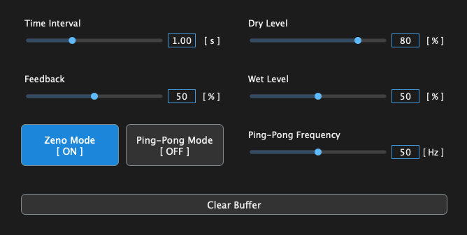
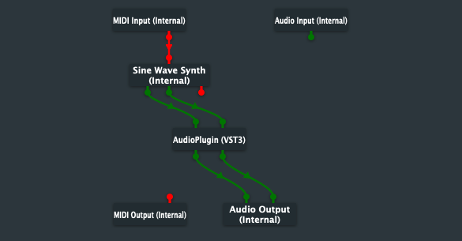

# Digital Delay Audio Plugin

A JUCE-based audio plugin that implements a flexible digital delay with dry/wet control, feedback, Zeno mode, and ping-pong stereo panning.

## Setup & Usage

To build and use this audio plugin:

1. **Install JUCE**
   Download and install JUCE from the official website.

2. **Open the Project**
   Open DigitalDelay.jucer in the Projucer and save the project to generate platform-specific files.

3. **Build the Plugin**
   - Open the generated project in your preferred IDE (e.g., Xcode, Visual Studio).
   - Build the project to generate the plugin binary (.vst3, .au, etc.).

4. **Load in a Host**
   - Use any DAW or the JUCE Audio Plugin Host to test the effect.
   - For detailed plugin-loading steps, see the JUCE basic plugin tutorial.

4. **Use the Plugin**
   - Adjust delay time, dry/wet mix, and feedback levels.
   - Enable Zeno mode for accelerating echoes, or Ping Pong for stereo panning.
   - Experiment with different combinations to shape the character of the delay.

## Audio Plugin Host Setup

When using the plugin inside the JUCE Audio Plugin Host (or any similar host), make sure that your output device is configured with two output pins.
Stereo output is required for effects like Ping Pong to function correctly.
If the host is set to mono or if only one output pin is connected, you will not hear any left/right movement.

The diagram below shows an example of a correct stereo setup:

## Features

| Parameter        | Description                                                |
|------------------|------------------------------------------------------------|
| **Time (s)**     | Delay time before the first echo.                          |
| **Dry (%)**      | Loudness of the original signal.                           |
| **Wet (%)**      | Loudness of repeated signals.                              |
| **Feedback (%)** | How strongly each echo feeds into the next.                |
| **Zeno**         | Halves the delay time on each repetition and uses fixed feedback. |
| **Ping Pong**    | Enables stereo panning for the delayed signal.             |
| **Ping Pong Rate** | Controls the speed of the left-right panning motion.     |

## Usage Notes 

- Zeno mode can become very loud when combined with high feedback values, so the plugin ignores the user-specified feedback amount and uses a fixed, safe value instead.

- Ping Pong mode is most noticeable with headphones or a wide stereo field. Make sure your headphones support stereo, since mono playback won’t reveal the left/right movement.
You can verify this using a video such as [Stereo Test – Left/Right Audio Test for Headphones/Speakers](https://www.youtube.com/watch?v=YwNs1Z0qRY0) on YouTube.